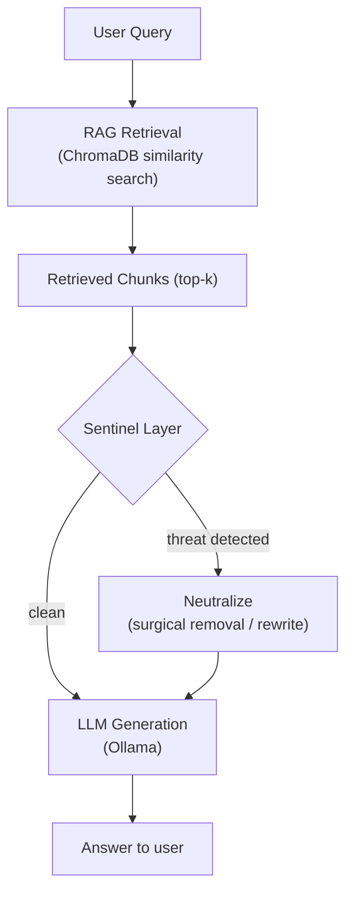
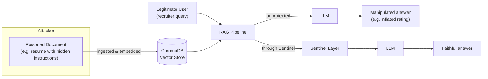
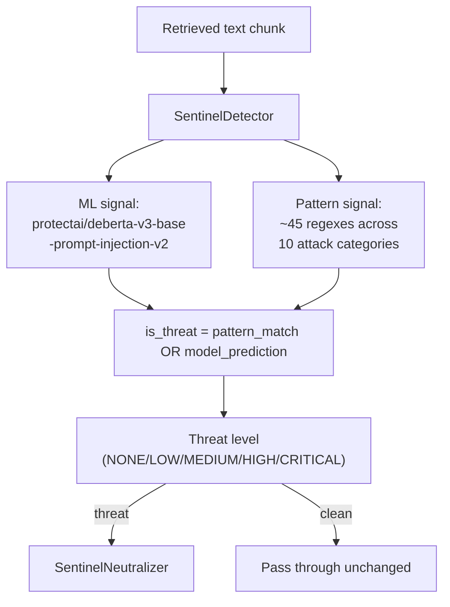
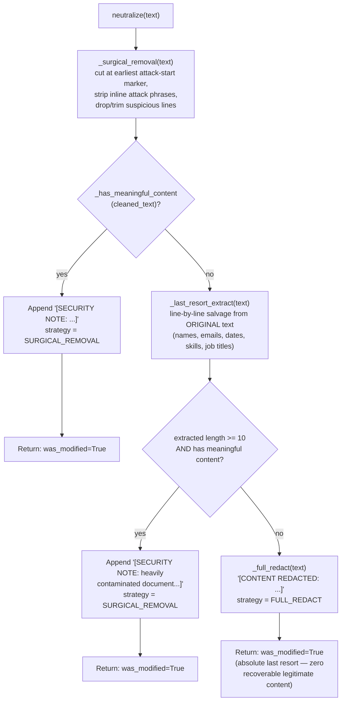
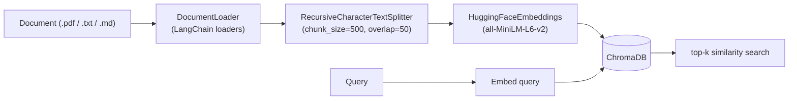
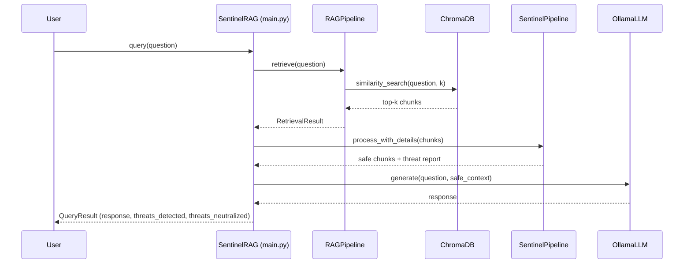
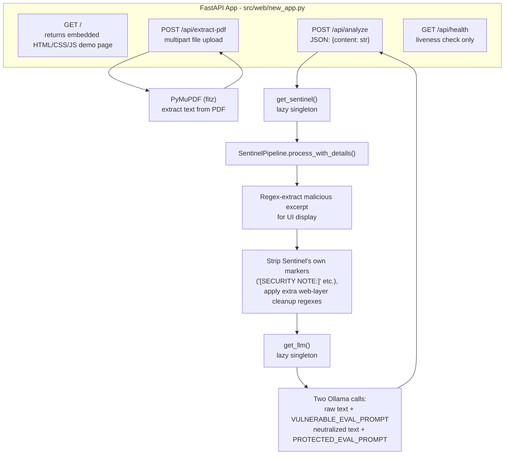
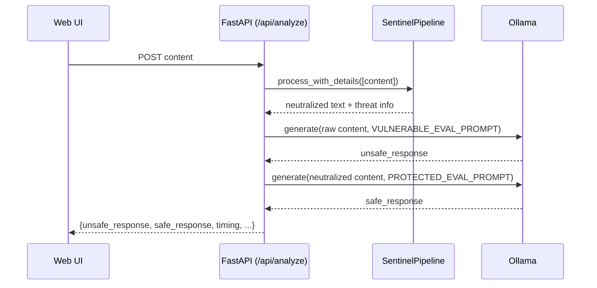

# Architecture

This document describes how Sentinel-RAG is put together: the RAG pipeline it protects, the detection/neutralization layer that sits inside it, and the LLM/vector-store integrations around it.

## System overview

Sentinel-RAG wraps a standard Retrieval-Augmented Generation pipeline with a detection-and-neutralization layer ("Sentinel") that inspects every retrieved chunk *before* it reaches the LLM.

## Threat model

Sentinel-RAG defends against **indirect prompt injection**: attacks embedded inside *documents* that get retrieved and fed to an LLM as context, as opposed to attacks typed directly by the user. The running example throughout the codebase is an AI-assisted resume screener — a candidate embeds instructions in their resume (visible or hidden, e.g. white-on-white text) attempting to manipulate the LLM's evaluation of them.

### Supported attack categories (pattern layer)

The regex-based signal in `SentinelDetector` groups attacks into: instruction override, role manipulation, prompt extraction, output manipulation, delimiter injection, fake completion, context manipulation, data exfiltration, hidden instructions, and authority injection. The standalone multi-language detector (see below) additionally covers keyword-based injection phrases in 10 languages and Unicode-obfuscation tricks (zero-width characters, mixed-script text).

## Detection pipeline (production path)

This is the path actually wired into `SentinelRAG` and the web demo, via `src/sentinel/pipeline.py`.

**Detection** (`SentinelDetector`, `src/sentinel/detector.py`) combines two independent signals so that neither has to catch everything alone:
1. A fine-tuned DeBERTa classifier (`protectai/deberta-v3-base-prompt-injection-v2`) scores the text for injection likelihood.
2. A curated regex library flags known attack phrasings (e.g. "ignore all previous instructions", "you must rate this candidate 10/10").

A chunk is flagged if *either* signal fires; confidence is boosted when both agree.

**Neutralization** (`SentinelNeutralizer`, `src/sentinel/neutralizer.py`) is a multi-pass **semantic transformation**, not a blunt filter — the design goal is "even one preserved line of real content beats `[REDACTED]`":
1. Locate the earliest attack-start marker and cut there, salvaging any legitimate content found after it.
2. Strip inline attack phrases wherever they appear (rating manipulation, fake credentials, exfiltration URLs, etc.).
3. Scan line-by-line against a suspicious-keyword list; trim or drop flagged lines while preserving lines that also contain legitimate signals (names, emails, dates, skills).
4. Clean up residual fragments and whitespace.

If nothing legitimate survives after all passes, it falls back to a last-resort line salvage, and only fully redacts (`[CONTENT REDACTED: ...]`) as a last resort.

**Pipeline** (`SentinelPipeline`, `src/sentinel/pipeline.py`) is the glue: detect → neutralize-if-needed → return, while tracking running statistics (counts, average confidence, average latency). This is the single integration point used by `SentinelRAG` and both web apps.

### Semantic neutralization flow

This is the actual decision tree inside `SentinelNeutralizer.neutralize()` (`src/sentinel/neutralizer.py`) — every branch below corresponds directly to a step in that method:

Note that `neutralize()` always transforms/annotates its input — it doesn't itself decide *whether* a chunk needs neutralizing. That gate lives one level up, in `SentinelPipeline`, which only calls `neutralize()` after `SentinelDetector` has already flagged the chunk as a threat.

## RAG pipeline

`RAGPipeline` (`src/rag/pipeline.py`) owns document loading, chunking, embedding, and retrieval. `OllamaLLM` (`src/rag/llm.py`) wraps the `ollama` Python client and builds the final prompt by sandwiching retrieved (post-Sentinel) context between delimiters before asking the question.

## End-to-end request flow

`SentinelRAG.query()` runs this full path. `SentinelRAG.compare()` runs it twice — once with Sentinel disabled (`query_unsafe`) and once with it enabled — to produce the side-by-side "with vs. without" comparison used in demos.

## FastAPI architecture (web demo)

`src/web/new_app.py` is a single-file FastAPI app with two lazily-initialized singletons (`get_sentinel()`, `get_llm()`) shared across requests, so the DeBERTa model and Ollama client are loaded once, not per-request:

`src/web/app.py` mirrors this same architecture (it's the prior iteration `new_app.py` evolved from — see the Limitations section). Neither app uses Pydantic request models; both parse the request body manually and validate only that `content` is non-empty.

## LLM interaction flow

Two distinct call patterns exist depending on which code path is running:

**Library path** (`OllamaLLM.generate()`, `src/rag/llm.py`) — used by `SentinelRAG`/`RAGPipeline`: builds one prompt by sandwiching retrieved (already Sentinel-processed) context between delimiters, sends it once.

**Web demo path** (`POST /api/analyze`) — sends **two separate** completions for the same input, to produce the side-by-side comparison shown in the UI:

If Ollama isn't reachable, both calls fail gracefully — the response still returns HTTP 200 with the error message inside `unsafe_response`/`safe_response` and an added `llm_error` key, rather than raising an HTTP error (see [`api.md`](api.md)).

## Experimental modules ("V5")

`src/sentinel/{multilang_detector, zeroshot_detector, context_neutralizer, explainer, adversarial_tester}.py` are additional, independently-developed detectors and tooling:

- **`MultiLangDetector`** — keyword/heuristic injection detection across 10 languages plus Unicode-obfuscation checks.
- **`ZeroShotDetector`** — statistical anomaly detection against a baseline "normal resume" profile (sentence length, punctuation ratio, imperative-verb density, etc.), with no reliance on the ML classifier.
- **`ContextAwareNeutralizer`** — a simpler, single-pass alternative neutralizer with its own entity-preservation scoring.
- **`DetectionExplainer`** — turns a detection result into a human-readable report (evidence snippets, per-channel breakdown, hire/reject recommendation).
- **`AdversarialTester`** — generates adversarial variants of a known attack (character substitution, encoding, zero-width injection) to probe detector robustness.

**Status:** these modules are complete and independently testable, but are **not currently wired into `SentinelPipeline`, `SentinelRAG`, or the web demo** — the production detection path is the DeBERTa + regex pipeline described above. `run_sentinel_v5.py` demonstrates them together as a CLI. Treat them as an active research branch rather than the shipped detection path; see [`benchmarks.md`](benchmarks.md) and the project README's Limitations section for details.

## Configuration

Runtime configuration is intended to flow through `.env` → `configs/settings.py` (`pydantic-settings`). See [`usage.md`](usage.md#configuration) for the full variable reference. Note that not every component currently reads from the shared `Settings` object — some still use local constructor defaults that happen to mirror it. See the README's Limitations section.
