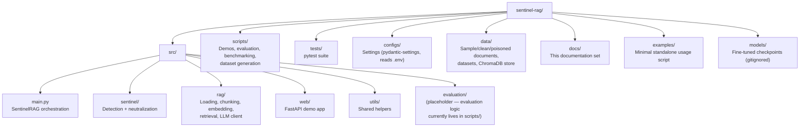
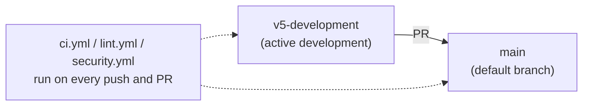

# Development

## Setup

```bash
python -m venv venv
source venv/bin/activate   # Windows: venv\Scripts\activate
pip install -r requirements.txt -r requirements-dev.txt
cp .env.example .env
```

## Running tests

```bash
pytest tests/
```

What's covered:

| File | Covers |
|---|---|
| `test_setup.py` | Core dependencies import cleanly (Sentinel, RAG modules, ChromaDB, PyTorch) |
| `test_detector.py` | `SentinelDetector` flags known attack phrasings and leaves benign text alone |
| `test_neutralizer.py` | `SentinelNeutralizer` transforms attack text and removes the attack phrase from output |
| `test_pipeline.py` | `SentinelPipeline` end-to-end: benign chunks pass through unchanged, attack chunks are neutralized, stats are tracked correctly |
| `test_e2e.py` | Full flow including a live Ollama call — automatically **skipped** if Ollama isn't reachable |

**What this suite does not cover:** the experimental V5 modules (`multilang_detector`, `zeroshot_detector`, `context_neutralizer`, `explainer`, `adversarial_tester`) have no automated tests yet — see [`architecture.md`](architecture.md#experimental-modules-v5). The evaluation/benchmark scripts in `scripts/` (attack success rate, latency, deepset benchmark) are separate from `pytest` — they're research tooling that produces the numbers in [`benchmarks.md`](benchmarks.md), not regression tests.

The first test run will download the DeBERTa detection model and the sentence-transformer embedding model from Hugging Face (a few hundred MB) if they aren't already cached — this can take a couple of minutes.

## Linting / formatting

```bash
ruff check .
black --check .
isort --check-only .
```

All three are configured in `pyproject.toml` to agree with each other (`isort` uses the `black` profile; `ruff` has `E501`/`E402` tuned for this codebase's known, intentional patterns — see the comments in `pyproject.toml`).

## Security scanning

```bash
bandit -r src scripts examples run_sentinel_v5.py
pip-audit -r requirements.txt
```

Both run in CI (`.github/workflows/security.yml`). See `SECURITY.md` for how to report a vulnerability, and the project's security review notes for known, accepted findings (e.g. the `chromadb` CVE that doesn't apply to this project's embedded-mode usage).

## Dependency updates

`requirements.txt`/`requirements-dev.txt` pin exact versions rather than open-ended floors (see the header comment in `requirements.txt` for why). When bumping a version: install it, re-run `pytest tests/`, re-run `scripts/evaluate.py` and the web demo manually, then update the pin.

## Project layout



## Git workflow

This repository uses two long-lived branches, not a full GitFlow model:



- Day-to-day work happens on `v5-development` (or a short-lived topic branch off it for larger changes).
- Changes reach `main` via pull request; GitHub Actions (`.github/workflows/`) runs tests, lint, and security scans on both branches and all PRs.
- Tags/releases are cut from `main` (see the project's release notes for the current version).

## Adding a new attack pattern

Regex patterns live in `src/sentinel/detector.py` (`SentinelDetector`, grouped by category) and `src/sentinel/neutralizer.py` (`SentinelNeutralizer.ATTACK_START_PATTERNS` / inline phrase lists). When adding a pattern:

1. Add a test case to `tests/test_detector.py` and/or `tests/test_neutralizer.py` first.
2. Add the corresponding sample(s) to `data/poisoned/` if it represents a new attack category worth tracking in evaluation runs.
3. Re-run `scripts/evaluate_large.py` and `scripts/evaluate_deepset.py` to confirm you haven't regressed recall/precision, and update [`benchmarks.md`](benchmarks.md) if the numbers change materially.

## Contributing

See [`CONTRIBUTING.md`](../CONTRIBUTING.md) at the repo root for the PR process, and [`SECURITY.md`](../SECURITY.md) for how to report a vulnerability.
